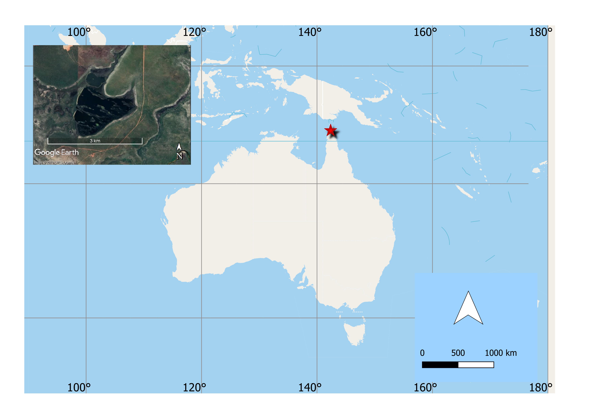

# Background and methods

```{r background_1, echo=FALSE,cache=FALSE,include=FALSE}
library(DiagrammeR)
library(knitr)
library(bookdown)
library(here)
```
This chapter includes a description of the study area and its modern and past climatic contexts. In addition, it introduces the methods used in the development of this thesis, following the two main components (geochronology and environmental change). 

## Study area

Cape York Peninsula is located at the northernmost point of Queensland on the north-eastern coast of Australia. It lies between 10°S and 16°S and is one of the monsoonal regions of Northern Australia, along with the Kimberley and the Top End (Arnhem Land). Most of the Peninsula has a strongly seasonal tropical climate (tropical savanna) [@peelUpdatedWorldMap2007] with just a small area of wetter Am (tropical monsoon) environment on the eastern coast [@peelUpdatedWorldMap2007]. Annual rainfall varies from 800 mm in the central-southern part to over 2000 mm near the Iron Range (Figure \@ref(fig:fig-cli-CP)). Approximately 80% of the average annual rainfall falls during the four months from December to March. Temperatures are generally warm to hot, with maximum temperatures being over 40 °C in summer [@environmentscienceservicesStageOverviewReports1995].

The vegetation of Cape York Peninsula is dominated by *Eucalyptus* spp. woodlands, open woodlands, and open-forests, which occupy 64 % of the area. The next most extensive vegetation group is the low open-woodlands, low woodlands, and tall shrublands, dominated by *Melaleuca* spp. (14.2 % of total area). Grasslands (6.1 %), rainforests (5.6 %) and heathlands (3.3 %) are the next most extensive vegetation types [@neldnerVegetationSurveyMapping1995; @foxVegetationAustralianTropical2001] (Figure \@ref(fig:fig-veg-CP)).

The region has an abundance of internationally and nationally important natural resources, including remnant rainforests, rich mineral reserves (bauxite, gold, kaolin, silica sand), and several rivers of high ecological significance, high biodiversity, and a strong Indigenous culture [@hitchcockNaturalAttributesWorld2013].

```{r fig-cli-CP,out.width = '80%', fig.align = "center", fig.cap = "(ref:fig-cli-CP)",echo=FALSE}

#

include_graphics(here("Figs","Background","CP_rainfall.png"))
```
(ref:fig-cli-CP) Average annual rainfall, 2012–2016. Source: Bureau of Meteorology Australian Water Availability Project gridded monthly data. Plotted by the Queensland Government Department of Environment and Science. Available at https://www.stateoftheenvironment.des.qld.gov.au/climate/climate-observations/annual-rainfall

```{r fig-veg-CP,out.width = '80%', fig.align = "center", fig.cap = "(ref:fig-veg-CP)",echo=FALSE}

#

include_graphics(here("Figs","Background","CP_veg.png"))
```
(ref:fig-veg-CP) Cape York Peninsula vegetation

## Study site 

Sanamere Lagoon (11.123°S 142.359°E; 15 m asl) is located close to the northern tip of Cape York Peninsula and is part of the Apudthama Land Trust Area, classified as Aboriginal Freehold land and managed under the Northern Peninsula Area Regional Council. The lagoon is 1 km north of the W-E flowing perennial Jardine River (Figure \@ref(fig:fig-jardine)). The climate of the region is monsoonal with 88 % of the annual 1753 mm rainfall falling between December and April with a mean annual temperature of 27 °C [@bomMonthlyClimateStatistics2018]. Winds are predominantly from the north-northwest and southeast in January and July, respectively [@bomRoseWindDirection2019] (Figure \@ref(fig:fig-wind-SAN)). Sanamere Lagoon is considered a sub-coastal wet heath swamp, and a palustrine system (a wetland with more than 30 % emergent vegetation) [@departmentofenvironmentscienceWetlandInfoWetlandSystems2018]. Sanamere Lagoon is also referred as of value as a “wilderness wetland area” [@abrahamsAreasConservationSignificance1995]. The Anggamudi (also known as Angkamuthi), Wuthahti (alternatively Wuthathi) and Yadhaigana (alternatively Yadhaykenu) people are the traditional owners of the Jardine River catchment [australianinstituteofaboriginaltorresstraitislanderstudiesAIATSISCollection2020].

Although most lakes dry out in this region during the dry season (May - November), the Water Observations from Space (WOfS) dataset [@muellerWaterObservationsSpace2016; @commonwealthofaustraliaUnfilteredSummaryAll2018] indicates that the deeper parts of Sanamere Lagoon have been permanently covered by standing water for the last 35 years, despite periods of significantly below average rainfall in this period (Figure \@ref(fig:fig-water-SAN)). The water depth during the dry season is 1.2 m for most of the lake. At this level, several relict dune features are exposed, dating from the time of lagoon impoundment. The lake was probably formed as a result of the collapse of laterite karst to form a sinkhole-like depression below the local water table [@grimes2008laterite]. During the wet season, the dune features are largely submerged and the lake outflows into the Jardine River.

Sanamere is in an enclosed basin surrounded by higher elevation land, with the highest point (57 m a.s.l.) to the north-northeast of the lagoon, close to the current Bamaga Road [@geoscience-australiaSRTMSecImage2015]. Based on topography, Sanamere Lagoon has an approximate catchment area of 9 km^2^, with the lowest overflow point at ~17 m a.s.l. to the west of the lagoon (Figure \@ref(fig:fig-DEM-SAN)).

```{r fig-jardine,out.width = '100%', fig.align = "center", fig.cap = "(ref:fig-jardine)",echo=FALSE, include=TRUE}
#library(knitr)
library(here)
include_graphics(here("Figs", "Background","Jardine.png"))#C:\Users\Maria Jose Rivera\OneDrive - James Cook University\Australia renamed\Sanamere\Thesis sections\PhD\Figs\vegetation C:\Users\Maria Jose Rivera\OneDrive - James Cook University\Australia renamed\Sanamere\Thesis sections\PhD\Figs\vegetation
```
(ref:fig-jardine) Map of the Jardine River National Park, Jardine River Resources Reserve and Heathland Resources Reserve, with Sanamere indicated in red and the Jardine River Wetlands Aggregation shaded blue (courtesy of Emma Rehn).

```{r fig-wind-SAN,out.width = '80%', fig.align = "center", fig.cap = "(ref:fig-wind-SAN)",echo=FALSE}

#

#include_graphics(here("Figs","Background","wind_SAN.png"))
include_graphics(here("Figs","Background","horn_wind.png"))
```
(ref:fig-wind-SAN) Average wind direction and speed 1995-2017, measured at 9 am in in January (left) and July (right), from Horn Island weather station.

```{r fig-water-SAN,out.width = '80%', fig.align = "center", fig.cap = "(ref:fig-water-SAN)",echo=FALSE}

#

include_graphics(here("Figs","Background","water_SAN.png"))
```
(ref:fig-water-SAN) WOfS data showing permanency of water in the lagoon	since 1986 with blue denoting areas permanently covered, possible relict dune features shown as low permanency areas, exposed in the dry season

```{r fig-DEM-SAN,out.width = '80%', fig.align = "center", fig.cap = "(ref:fig-DEM-SAN)",echo=FALSE}

#

include_graphics(here("Figs","Background","DEM_SAN.png"))
```
(ref:fig-DEM-SAN) Digital elevation map of Sanamere Lagoon and surrounds, with the approximate catchment area of the lagoon marked in orange and western low point (outlet) circled in black. Darker green indicates higher elevation (diagram courtesy of Emma Rehn).

### Geology and lake formation

The geology of the watershed is represented by middle Jurassic to Early Cretaceous Helby Beds (Geology 1:250,000 sheet SC54-15)[@AustralianGeoscienceInformation2020], which are composed by clayey quartzose sandstone and  pebble conglomerate, not underlain by carbonate-bearing lithologies. The lake is likely to have formed by a collapse into cavities formed by dissolution of underlying rock and it is an example of ‘laterite karst’ [@grimes2008laterite]. 

### Vegetation {#veg}

The vegetation around the lake edge is dominated by sedgeland, open-heaths, dwarf open-heaths and woodlands. Between the edge and 50 m sedges such as *Eleocharis sphacelate* dominate the landscape (Figure \@ref(fig:fig-veg2)). Between 50 m and 300 m vegetation transitions to open heath and shrubland, which then account for most plant species, *Neofabricia*, *Asteromyrtus*, *Baeckea*, *Jacksonia*, *Hibbertia*, *Thryptomene*, *Allocasuarina* and *Grevillea* (Figure \@ref(fig:fig-veg1)). At 300 m from the lake there is another transition to *Eucalytus* woodlands, especially *Eucalyptus tetrodonta* (Figure \@ref(fig:fig-veg3)) [@neldnerVegetationSurveyMapping1995]. Smaller sub-canopy trees are common and include *Acacia*, *Grevillea glauca* and *Grevillea pteridifolia* as well as *Livisonia* palm, with *Asteromyrtus* present as shrub. *Banksia* and *Casuarina* are present in wetter low-lying areas. Grasses dominate the ground cover in this area (Poaceae) and leaf litter is greater than that found in the heathland.

```{r fig-veg-SAN,out.width = '80%', fig.align = "center", fig.cap = "(ref:fig-veg-SAN)",echo=FALSE}

#

#include_graphics(here("Figs","Background","SAN_veg.png"))
```
(ref:fig-veg-SAN) Vegetation surrounding Sanamere Lagoon


```{r fig-veg2,out.width = '100%', fig.align = "center", fig.cap = "(ref:fig-veg2)",echo=FALSE, include=TRUE}
#library(knitr)
include_graphics(here("Figs","vegetation","0_waterline.png")) #C:\Users\Maria Jose Rivera\OneDrive - James Cook University\Australia renamed\Sanamere\Thesis sections\PhD\Figs\vegetation C:\Users\Maria Jose Rivera\OneDrive - James Cook University\Australia renamed\Sanamere\Thesis sections\PhD\Figs\vegetation
```
(ref:fig-veg2) Vegetation at the Sanamere Lagoon waterline, comprised of sedges and scattered Pandanus

```{r fig-veg1,out.width = '100%', fig.align = "center", fig.cap = "(ref:fig-veg1)",echo=FALSE,include=TRUE}
#library(knitr)
include_graphics(here("Figs","vegetation","0_50_heathland.png"))
```
(ref:fig-veg1) Open heathland vegetation 50 metres from the waterline

```{r fig-veg3,out.width = '100%', fig.align = "center", fig.cap = "(ref:fig-veg3)",echo=FALSE,include=TRUE}
#library(knitr)
include_graphics(here("Figs","vegetation","400_Eucalyptus.png"))

```
(ref:fig-veg3) Eucalyptus woodland at 400 m (right) from the waterline

### Soils

Sanamere’s catchment is characterized by deep bleached uniform yellow earthy sands with poor drainage, flooding and low fertility. Soils are primarily derived from sandstone (Kandosols and Tenosols) [@biggsSoilsCapeYork1995]. Tenosols on undulating rises of sandstone comprise the largest unit within the Heathlands Landscape. Both the Kandosols and Tenosols are infertile.

### Fire

Northern Australia is the most fire‐prone area of Australia, with around 250,000–450,000 km^2^ burnt each year [@russell-smithFireManagementBusiness2016]. Australian savannas are characterized by low nutrient soils, highly connected landscapes with few topographic barriers that help generate fire regimes of frequent, intense and large fires [@stevensSavannaWoodyEncroachment2017]. These fires are one of the main drivers of vegetation dynamics and climate in the area. For example, the role of fire in controlling the balance between grasses and woody vegetation in savannas have been widely studied [@lehmannDecipheringDistributionSavanna2011], and most literature suggests that frequent fire reduces woody growth rates and tree density, and creates an environment more suitable for C~4~ grasses [@lehmannDecipheringDistributionSavanna2011]. However, recent studies debate the role of fire regimes to reduce canopy vegetative cover and argue that this role is much more limited in impact than often assumed [@veenendaalRelationshipFireRegime2018]. In palaeoecological research, burning has also been related to the opening of woodland (canopy and subcanopy) and creating patches of different plant communities [@roweLateHoloceneSwamp2015].

In the 18-year period spanning 2000-2019, the area immediately surrounding Sanamere Lagoon (catchment and beyond) burned on average every 3 to 7 years [@northaustraliarangelandsfireinformationData2020]. Fire scars recorded in this period over the surface of the lagoon (Figure \@ref(fig:fig-fire-SAN)) are likely a result of error in the determination of fire scars [@rehnFireEnvironmentalChange2020]. However, fire scars that extend substantially beyond the water surface may be assumed to represent real scars.

Most fires occur each year during the later dry season (July - November). During April to July, fires in northern Australia are associated with lower air temperatures, higher moisture content, burning of smaller areas and may leave unburnt patches. Fires occurring between August and November are typically high intensity, and burn large areas [@evansDeliveringEffectiveSavanna2020]. Australian Aboriginal people have used fire to manage the landscape for millennia. However, in the early 20th century the removal of Indigenous people to missions might have reduced intensive management of fire regime [cookeCultureEcologyEconomy2009].

```{r fig-fire-SAN,out.width = '100%', fig.align = "center", fig.cap = "(ref:fig-fire-SAN)",echo=FALSE,include=TRUE}
#library(knitr)
include_graphics(here("Figs","Background","fire_SAN.png"))

```
(ref:fig-fire-SAN) Number of years areas around Sanamere burned in the 10 years 2010 - 2018

## Climatic context 

### Modern climate

The climate of the northeastern Australia's tropical savannas is largely determined by the annual movement of the monsoon system. Along with the monsoon, the southeasterly trade winds along the east coast during the dry season define most of the area [@shiClimateDataTheir2016]. The monsoons are active from about November to March and are followed by a distinct seasonal drought for the remainder of the year. Tropical cyclones that form over the adjacent ocean also influence the climate of the Peninsula and cause extreme episodic rainfall events during the wet season. The main driver of Australian rainfall variability is El Niño–Southern Oscillation (ENSO) in the Pacific Ocean [@risbeyRemoteDriversRainfall2009]. However, the Indian Ocean dipole (IOD) and Madden–Julian oscillation (MJO) also contribute to rainfall variability in northern Australia [@bomAustralianClimateInfluences2010].

The influence of the monsoon is controlled by the position of the Intertropical Convergence Zone (ITCZ) and the Indo-Pacific Warm Pool (IPWP). Their impact in the climate system is determined by the oceanic circulation system. For instance, the Indo-Pacific Warm Pool provides a large moisture source for the Northwest Monsoon and is an important component of the coupled ocean-atmosphere processes that gives rise to the El Niño–Southern Oscillation (ENSO) [@kershawAustraliaSouthwestPacific2012].

The monsoon system is divisible into three spatial components: the Northwest Monsoon that derives its moisture from the equatorial seas to the north and is considered to be 'pushed' by the Asian winter monsoon; the Pseudo-Monsoon of northwestern Australia that is driven by moist winds emanating from the Indian Ocean; and the Quasi-Monsoon that derives much of its moisture from easterly Pacific Ocean winds [@gentilliClimatesAustraliaNew1971]. The Australian monsoon alternates between two seasonal phases linked to wind direction. In the winter phase, easterly trade winds bring dry conditions, and particularly the northern Australian region experiences an almost rainless dry season of about 7–8 months. In the summer, westerly winds bring sustained rainy conditions, torrential rains and, cyclones (Figure \@ref(fig:fig-modern)).

```{r fig-modern,out.width = '80%', fig.align = "center", fig.cap = "(ref:fig-modern)",echo=FALSE}

#include_graphics(here("Figs","Background","climate_BOM.png"))

include_graphics(here("Figs","Background","climate_NA.png"))
```
(ref:fig-modern) Influences on modern Australian climate. Modified from @risbeyRemoteDriversRainfall2009. © American Meteorological Society. Used with permission. 

### Past climate, vegetation and fire {#pastclimate}

The following section summarises the current knowledge of past climate in the study area (covering ~ 800 km around the region), following the chronological divisions proposed by @reevesPalaeoenvironmentalChangeTropical2013. For each record, the calibrated chronology is used (thousand calibrated years before the present), and referred to as “ka” throughout. The Glacial period is considered to span 30 ka – 18 ka, including the LGM (21 ka –18 ka); the Deglacial is considered to span 18 ka – 12 ka; and the Holocene is considered to begin at 12 ka. The Holocene is further split into three classifications: early (12 ka – 8 ka); mid (8 ka – 4 ka); and late (4 ka – present). Late Marine Isotope Stage 3 (MIS 3) is considered to be from ~ 50 ka – 29 ka and Late Marine Isotope Stage 3 (MIS 2) from 29 ka - 14 ka. Where the text refers to climatic changes with no specific values, for example “warmer” or “drier”, these changes are in relation to the previous time period.

As mentioned in chapter 1, the past climate information available for northern Australia is limited (including about monsoon and ENSO dynamics). Besides the monsoon system, the climate of Cape York Peninsula was influenced by changes in sea level (section \@ref(palaeogeo)). Changes in the strength of the monsoon has been documented by studies in adjacent regions [@jiangConceptGlobalMonsoon2015; @dennistonDecouplingMonsoonActivity2017; @yanUnderstandingAustralianMonsoon2018], along with past changes in sea level and shorelines. However, the data available for several sites in the region are not representative of the entire area. Near Cape York, the longest records (beyond the Holocene) are derived from upland areas to the south (Atherton Tablelands) or marine records which experience local environmental conditions that are not necessarily representative of lowland sites [@shulmeisterPollenEvidenceTropical1995] (Figure \@ref(fig:fig-climate), Table \@ref(tab:tb-sites)). 

```{r fig-climate, out.width = '100%',fig.align = "center", fig.cap = "(ref:fig-climate)",echo=FALSE}

#out.width = '100%'
#

#include_graphics(here("Figs","Background","climate_sites.png")) 
#include_graphics(here("Figs","Background","climate_all.png"))#change qgis, aus project, climate_all
include_graphics(here("Figs","Background","cleaned_climate_2.png")) #cleaned_climate in aus

```
(ref:fig-climate) Location of sites mentioned in the text (refer to Table \@ref(tab:tb-sites) for details)

```{r tb-sites,echo = FALSE, eval=TRUE, include = TRUE,warning=FALSE}
library(tidyverse)
library(kableExtra)
#library(flextable)
#climate<-read.csv(here("data","climate_sites_7.csv"))

climate<-read.csv(here("data","cleaned_final.csv"))


climate<-climate%>%
        rename("Length (ka)"= 'Length', "Number"="X")
#library(officer)      

#table77<-regulartable(climate)
#table88<-theme_vanilla(set_table_properties(table77, width=1,layout = "autofit"))
#table8<-italic(table8,j=1)
#word_export <- read_docx()
#body_add_flextable(word_export, table7)
#body_add_par(word_export, value = "")

#print(word_export, target= here("data", "table_ch5_2.docx"))        

#save_as_docx(table88, path = here("data", "table_ch2_1.docx"))
#pp_rc_t<-climate%>%
 #       flextable()%>%
  #      set_table_properties(width = 0.75,layout = "autofit")
#climate%>%
 #       knitr::kable("latex", booktabs = TRUE,
 # caption = "(ref:tb-sites)")%>%
  #      kableExtra::kable_styling(position = "center", latex_options = "scale_down")

climate%>%
        knitr::kable("latex",booktabs = TRUE,
  caption = "(ref:tb-sites)" ,longtable=TRUE)%>%
        kable_styling(latex_options = c("repeat_header"))%>%
        kableExtra::kable_styling(position = "center")%>%
kableExtra::column_spec(7, width = "5cm")%>%
        landscape()

#pp_rc_t<-climate%>%
 #       flextable()%>%
  #      set_table_properties(width = 0.75,layout = "autofit")
#print(pp_rc_t)
```
(ref:tb-sites) Latitude, longitude and length of the past environmental records discussed in the text

#### Glacial (30 ka - 21 ka) and LGM (21 ka - 18 ka) {#LGM}

The longest palaeoecological records from northern Australia come from Lake Carpentaria, and several studies have defined the extent and lake level fluctuations during the late Quaternary in this region [@jonesLateQuaternaryEvolution1988; @mccullochStrontiumIsotopeVariations1989a; @reevesPalaeoenvironmentalChangeGulf2007; @reevesSedimentaryRecordPalaeoenvironments2008; @torgersenLateQuaternaryHydrological1985a; @devriendtLateQuaternaryEnvironment2011]. @torgersenLateQuaternaryHydrological1985a estimated the regional evaporation to precipitation ratio to have remained twice the modern ratio between 41 ka to 12 ka,  suggesting drier conditions. Additionally, irregular patterns of precipitation during the LGM are suggested by the highly variable Mg/Ca, Na/Ca, Sr/Ca, and $\delta$^18^O.

Additional evidence of aridity in northern Australia comes from analysis of aeolian dust activity [@dedeckkerLatePleistoceneRecord1991; @dedeckkerLateQuaternaryCyclic2001] in the Gulf of Carpentaria. The most pronounced arid period peaks around 21.5 ka, corresponding to the start of the period of lowest global sea level and glacial advance. Other peaks were found at ~ 25.5 ka, ~ 29.5 ka, 24 ka, and 19.3 ka [@dedeckkerLateQuaternaryCyclic2001]. Furthermore, evidence of fluvial activity in the north of Australia generally supports drier conditions through the LGM [@nansonComparativeUraniumThoriumThermoluminescence1991; @nansonQuaternaryStratigraphyGeochronology1993].

There are no terrestrial records of climate, vegetation, and fire in Cape York between 30 ka - 18 ka. All of the available records are from south Cape York in the humid, not seasonal, tropics on the Atherton Tablelands. In this area, three sites have been extensively studied: Lynch’s crater [@kershawCompletePollenRecord2007;@turneyGeochemicalChangesRecorded2006a;@turneyMillennialOrbitalVariations2004a], Lake Euramoo [@haberle23000yrPollen2005], and Bromfield swamp [@burrowsNewLateQuaternary2016a]. The available lines of evidence suggest the Glacial and LGM periods to be drier and cooler than today in this sector. Before the LGM, palynological analyses report dry, open woodlands on the Atherton Tablelands, Lynch’s Crater and Lake Euramoo [@turneyMillennialOrbitalVariations2004a; @kershawPleistoceneVegetationHumid1994]. Vegetation records from Lynch's Crater, Lake Euramoo [@haberle23000yrPollen2005] and ODP 820 [@mossLateQuaternaryMarine2007] suggest the dominance of sclerophyll woodland (i.e. Casuarinaceae and Myrtaceae). Except for Lynch's Crater, other records from the region indicate increased presence of grasses during the LGM [@petherickClimaticEnvironmentalVariability2011]. Further evidence of elevated values of Poaceae during the LGM is found in the pollen record from nearby marine core ODP820 [@mossLateQuaternaryMarine2007]. @burrowsNewLateQuaternary2016a suggested marked changes in effective precipitation (towards drier conditions) at 32.7 ka, 30.1 ka, 24.7 ka, and 21.9 ka in Bromfield Swamp.

In the broader tropical Australasian region, most studies agree on evidence of drier, cooler conditions between ~ 33 ka and 18 ka across the area [@dennistonNorthAtlanticForcing2013; @dinezioEffectSeaLevel2013a; @reevesPalaeoenvironmentalChangeTropical2013], with a lesser number reporting the existence of wetter events, some of them episodic [@nott30000Year1996; @mullerPossibleEvidenceWet2008a; @burrowsNewLateQuaternary2016a; @dennistonDecouplingMonsoonActivity2017]. For instance, extreme flood events just before 23 ka were detected by @nott30000Year1996 and @nottWaterfallsFloodsClimate1999, although the timing of these events should be taken with caution as dates could be overestimated [@mayRefiningLateQuaternary2015]. @mullerPossibleEvidenceWet2008a found evidence of wet conditions during Heinrich events at 30 ka – 29 ka and 24 ka – 23 ka in Lynch’s Crater. Changes in monsoon strength during the LGM have been proposed by several studies [@jiangConceptGlobalMonsoon2015; @dennistonDecouplingMonsoonActivity2017; @yanUnderstandingAustralianMonsoon2018]. For example, @yanUnderstandingAustralianMonsoon2018  found that while the annual mean precipitation over the Australian monsoon region decreased, the annual range was enhanced.

Except for Lake Carpentaria, all studies from the region have fire records, most of them younger than ~ 12 ka. Both Lynch's Crater and ODP 820 have records for the LGM and the Glacial, with high charcoal values during the LGM [@kershawPleistoceneVegetationHumid1994; @mossLateQuaternaryMarine2007; @kershawCompletePollenRecord2007] or increased availability of biomass (e.g. sclerophyll woodland) for burning [@kershawPleistoceneVegetationHumid1994].

#### Deglacial (18 ka - 12 ka)

The increase in lake level at Lake Carpentaria during the Deglacial suggests wetter conditions in the region, possibly associated with the reactivation of the monsoon. While wetter conditions are reported in Lake Euramoo related to the growth of *Eucalyptus* woodland, Lynch’s Crater and the ODP 820 records show evidence of dry conditions based on vegetation [@kershawQuantitativePalaeoclimaticEstimates1988; @mossLateQuaternaryMarine2007; @turneyMillennialOrbitalVariations2004a; @kershawCompletePollenRecord2007]. Likewise, in Broomsfield swamp decreases in effective precipitation at 13.9 ka – 13.4 ka and 11.9 ka were identified [@burrowsNewLateQuaternary2016a].

Fire records in the dry tropics report negligible or low burning activity during this period [@roweHoloceneSavannaDynamics2019; @fieldLateQuaternaryRecord2017], except for Lake Euramoo, where fire was much more prominent in the landscape starting at 16.8 ka.

#### Holocene (12 ka - Present)

* Early Holocene (12 ka - 8 ka)

Warmer and wetter conditions have been proposed to be dominant during the early Holocene in the northern Australian tropics. Records from the west of the Gulf of Carpentaria (Four Mile Billabong and Walala) point to effective precipitation rises from ~ 10 ka to 5 ka. The very few studies from the savannas of Cape York are limited to those derived from lake sediment cores with records beginning at the middle Holocene. These studies include Big and Little Willum [@proskeHoloceneDiatomRecords2017a; @stevensonPalaeoenvironmentalHistoryBig2015] and Three-Quarter Mile Lake [@lulyHolocenePalaeoenvironmentsChange2006], and propose an increase in effective precipitation ~ 7.9 ka, consistent with studies from the Atherton Tablelands and the Kimberley [@shulmeisterHolocenePollenRecord1992; @haberle23000yrPollen2005; @dennistonStalagmiteRecordHolocene2013; @roweHoloceneSavannaDynamics2019]. In Big Willum, as open water developed, from ~ 7 ka – 5 ka, grass and sedge representation declined as the swampy basin bottom became fully submerged. Several coastal sites in the area (Western Torres Strait, Lizard Island) record widespread mangrove forest development led by the early Holocene sea level rise [@rowePalynologicalInvestigationHolocene2007; @proskeIslandEcosystemBiodiversity2012]. Changes in vegetation suggest increased rainfall in Lake Euramoo. @haberle23000yrPollen2005 found the maximum rate of increase in rainforest between 9.6 ka and 8.7 ka. These changes are most likely to represent the local establishment of closed canopy rainforest under the influence of increasing precipitation at Lake Euramoo.

* Mid and Late Holocene (8 ka - Present)

The middle Holocene has also been identified as a period of increased precipitation in the northeastern Australia's humid tropics and Western Torres Strait. In Broomfield Swamp, geochemical evidence derived from elemental counts (ITRAX) (rise in Ti and Ge) suggests a wetter period (8.5 ka - 5.9 ka) compared to the periods before and after [@burrowsNewLateQuaternary2016a]. Another phase of increased precipitation for Lake Euramoo is suggested around 7.3 ka to 6.3 ka, when rainforest achieved its maximum extent across the Atherton Tablelands. @shulmeisterAustralasianEvidenceMidholocene1999 places the mid-Holocene precipitation maximum between 5 ka - 3.7 ka for the Northern Territory and north Queensland. In the Torres Strait, the prominence of island rainforest elements during the early-mid Holocene likely reflects the timing and influence of higher rainfall and humid climate. Additional evidence of a wetter phase is present at 6 ka in Lizard Island, where a possible cyclone event was documented [@proskeIslandEcosystemBiodiversity2012]. Extensive stable mangrove communities dominated coastal Torres Strait, starting at 6 ka and 3 ka [@rowePalynologicalInvestigationHolocene2007]. Overall, pollen from northern Australia also reflects woodland expansion at this time, and modern vegetation established [@proskeHoloceneRecordCoastal2014]. Whiterspoon swamp also shows a wetter phase during the mid-Holocene, with an increase in sedges and sclerophyll taxa [@mossHoloceneEnvironmentsSclerophyll2012a]. 

Quantitative estimates derived from offshore pollen records also indicate peak precipitation between 7 ka and 6 ka [@vanderkaars100000yearRecord2006]. These changes are associated with the flooding of the continental shelf and the ‘big swamp phase’, as sea levels increase during the deglaciation and early Holocene [@woodroffeDevelopmentWidespreadMangrove1985].

Two increases in charcoal accumulation were identified at 8 ka in Lake Euramoo [@haberle23000yrPollen2005], while in Big Willum a peak was identified at 7.2 ka [@stevensonPalaeoenvironmentalHistoryBig2015]. Vanderlin Island in the Gulf of Carpentaria shows an increase around 6 ka. In summary, these peaks suggest increased burning during the middle Holocene in the area.

In northern Australia, the late Holocene is associated with climatic variability, peat/wetland establishment and localised episodic aridity. For example, the available records from Lake Euramoo and Lynch’s Crater agree that this period was characterised by increased seasonality [@haberle23000yrPollen2005; @reevesPalaeoenvironmentalChangeTropical2013]. Similarly, @headPalaeoecologyArchaeologyEast1992 identify “increasing climatic variability” in the last 3000 years from dune instability in the East Kimberley. Evidence and derived discussions from several sites across northern Australia from @leesGeomorphologicalEvidenceLate1992a, @shulmeisterAustralasianEvidenceMidholocene1999, and @gaganPostglacialEvolutionIndoPacific2004, including the western Torres-Strait [@rowePalynologicalInvestigationHolocene2007] point to conditions during the mid-to-late Holocene as much drier than the previous early-to-mid Holocene phase. @haberle23000yrPollen2005 identifies drier conditions and increased rainfall seasonality after ~ 4 ka. @stevensonPalaeoenvironmentalHistoryBig2015 note the end of a “warm and wet period” at ~ 5 ka at Big Willum Swamp and identify the period between 1 ka - 0.4 ka as the period of “greatest variability” at the site. Similarly, in Witherspoon swamp, @mossEnvironmentalContextLate2015 identified a period of dry conditions starting at 2 ka.

@burrowsNewLateQuaternary2016a identified a dry event in the Bromfield Swamp and Quincan Crater records at 4.1 ka as a possible indicator of “substantial climate change”. @mackenzieGeochemicalInvestigationSouth2017 describe variable conditions over the last 1.25 ka in the South Wellesley Islands, including storm events, wet conditions at one site around 0.750 ka and a drying trend beginning in the last 150-50 years across three swamps.

The Late Holocene was also a period of wetland and peat establishment reported at several sites [@roweLateHoloceneSwamp2015; @stevensonPalaeoenvironmentalHistoryBig2015; @lulyHolocenePalaeoenvironmentsChange2006]. In the Torres Strait Islands, freshwater swamps developed by 2.6 ka with palynological records dominated by *Melaleuca* and the herbaceous swamp taxa *Leptocarpus* and Cyperaceae [@roweLateHoloceneSwamp2015]. Records at Boigu Gawat 1 and Boigu Gawat 2 in Torres Strait, suggest that wetlands became more productive, organic material increased and coastal influence was reduced [@rowePalynologicalInvestigationHolocene2007; @roweLateHoloceneSwamp2015]. Records in the Gulf of Carpentaria show expansion and development in the late-Holocene. Walala swamp in Vanderlin Island was fully developed by 4.5 ka with organic sediments increasing in the last 2 ka [@prebbleHolocenePollenDiatom2005]. Four Mile Billabong also expanded in the last 1 ka. At Big Willum swamp increased precipitation is maintained between 2.2 ka and 1.3 ka [@proskeHoloceneDiatomRecords2017a]. 

Locations such as the Torres-Strait [@roweLateHoloceneSwamp2015] show an increase in charcoal accumulation (and therefore, fire) during the last millennium before the present. Big Willum in Western Cape York shows peaks after 2 ka. Variable patterns of burning have been identified during the Late Holocene [@rowePalynologicalInvestigationHolocene2007; @roweLateHoloceneSwamp2015; @fieldCoherentPatternsEnvironmental2018; @haberle23000yrPollen2005]. Some studies have argued that this pattern in the later Holocene reflects an increase in climate variability associated with more active ENSO cyclicity [@mooneyLateQuaternaryFire2011; @kershawCompletePollenRecord2007].

### Palaeogeography of Cape York Peninsula (33 ka - Present) {#palaeogeo}

This section presents the available information on changes on palaeogeography, specifically sea level and dune formation in northern Australia and the broader region. Cape York Peninsula underwent major changes in geography during the last 33 ka, especially related to changes in sea level. By compiling a range of Late Quaternary sea-level indicator data, @brookePalaeoshorelinesAustralianContinental2017 and @lambeckSeaLevelGlobal2014 found an abrupt decrease in sea level ~ 30 ka (from - 83 m to - 126 m) in the Australian/South Pacific region (Figure \@ref(fig:fig-sea2), Figure \@ref(fig:fig-sea) and Table \@ref(tab:gc)). In Lake Carpentaria, during MIS 3 (57 ka- 29 ka), fully lacustrine conditions are confirmed by the ostracod Ba/Ca ratios, and the lake level corresponding to the - 60 m bathymetric contour, including increased intensity of fluvial sediment transport occurred during the MIS 3 and MIS 1 [@reevesSedimentaryRecordPalaeoenvironments2008].

Additional records from Lake Carpentaria indicate that lake levels dropped during the LGM (from the 59 m bathymetric contour during mid-MIS 3 to the 63 m bathymetric contour during the LGM). Episodes of sand deposition (aeolian or fluvial origin) at 26 ka, 24 ka and 21.5 ka at Lake Carpentaria are interpreted as arid events [@dedeckkerLateQuaternaryCyclic2001] that closely match periods of elevated monsoon rainfall in the Ball Gown Cave record (northwestern Australia) [@dennistonNorthAtlanticForcing2013].  During the LGM, large fluctuations of the lake level at the seasonal and interannual time scale are inferred from the $\delta$^18^O values and trace-element ratios of ostracod shells [@devriendtLateQuaternaryEnvironment2011]. Fluvial activity continued through this period to maintain the lake permanently in the deeper regions of the basin. The sedimentary record indicates a temporary contraction of the lake to around the − 63 m contour (23–19 ka), during which the sea was at its lowest level (approximately − 125 m) [@brookePalaeoshorelinesAustralianContinental2017; @yokoyamaShorelineReconstructionAustralia2001]. 

Lowered glacial sea level exposed the Sahul shelf, the continental shelf extending over from the northern coast of Australia to the island of New Guinea, south of the Gulf of Carpentaria and the Timor Sea. Its exposure could have sizable impact on IPWP climate given their central location between areas of deep convection of the IPWP [@dinezioClimateResponseIndo2016] (Figure \@ref(fig:fig-sea3)). 

Low sea levels during the LGM also influenced dune formation and emplacement in tropical Australia (Figure \@ref(fig:fig-geo)). Dune emplacements in Cape Arnhem [@leesThermoluminescenceDatingDune1995], Cape Flattery and Shelburne Bay between 24 and 18 ka appear to represent a period of widespread dune activity associated with the LGM. Dune formation occurred at glacial low sea levels when wide areas of continental shelf became exposed to wind action [@leesReconnaissanceThermoluminescenceDating1990; @leesGeomorphologicalEvidenceLate1992a; @leesTimingFormationCoastal2006] (Figure \@ref(fig:fig-sea)).

Lagoons also record aeolian and dune activity. For example, in Native Companion Lagoon (NCL), in North Stradbroke Island (southeast Queensland), the significant local sand and dust content of the NCL record for this period indicate that the dunes surrounding NCL were active, most likely in response to a reduced cover of vegetation. The LGM is shown as the period of maximum aeolian sedimentation, as a result of decreased precipitation. Loss of vegetation cover and subsequent destabilization of dunes would account for the increased deposition of local North Stradbroke Island sediments in Native Companion Lagoon at this time [@petherickReconstructingTransportPathways2009; @mcgowanAeolianSedimentationClimate2008].

In a regional context, several studies have highlighted the impact of changing sea levels on the hydroclimate. For example, @dinezioEffectSeaLevel2013a highlight the importance of continental shelf exposure during low sea levels on IPWP hydrology during the LGM, when comparing the results from several studies in the region. The study by @dinezioEffectSeaLevel2013a also suggests that sea level is a first-order driver of tropical hydroclimate on glacial–interglacial timescales, and that the exposure of the Sunda Shelf best explain the pattern of hydroclimatic change inferred from the proxies. Dry conditions may have been maintained until flooding of the Sunda–Sahul shelf, at the end of the deglaciation, according to several studies [e.g. @dedeckkerStatusIndoPacificWarm2003; @dinezioEffectSeaLevel2013a].

```{r fig-sea3,out.width = '80%', fig.align = "center", fig.cap = "(ref:fig-sea3)",echo=FALSE}

#

#include_graphics(here("Figs","Background","climate_sites.png")) 
#include_graphics(here("Figs","Background","climate_all.png"))#change qgis, aus project, climate_all
include_graphics(here("other","Background","sahul_2.png")) #cleaned_climate in aus

```
(ref:fig-sea3) Sahul ~ 20 ka. Yellow line denotes modern coastline. Source: http://sahultime.monash.edu.au/


```{r fig-sea2,out.width = '80%', fig.align = "center", fig.cap = "(ref:fig-sea2)",echo=FALSE}

#

#include_graphics(here("Figs","Background","climate_sites.png")) 
#include_graphics(here("Figs","Background","climate_all.png"))#change qgis, aus project, climate_all
include_graphics(here("Figs","Background","sea_level_3.png")) # graphs_August_20.R ,cleaned_climate in aus

```
(ref:fig-sea2) Changes in sea level according to @lambeckSeaLevelGlobal2014

At Lake Carpentaria, beginning at 18 ka there is evidence of increased run-off and weathering. Increasing contributions from southern rivers and decreased salinity during 18 ka - 15 ka are interpreted as evidence of the reactivation of the monsoon. Sedimentological evidence suggests a significant increase in lake level and extent after 18 ka [@reevesSedimentaryRecordPalaeoenvironments2008]. This is confirmed by freshening of the lake and a considerable decrease in the lake water $\delta$^18^O variability after 18 ka [@reevesSedimentaryRecordPalaeoenvironments2008]. The maximum lake level (> 3 m average depth) and extent (> 100,000 km^2^), as well as the lowest salinity, are recorded between 14 ka and 12 ka, suggesting the monsoon reached northeastern Australia around this time [@reevesSedimentaryRecordPalaeoenvironments2008]. A shell-rich layer (19.0 ka – 17.1 ka) indicates a highly productive environment, associated with an influx of fresh water and increased precipitation. These changes are reflected in the sea level curve built by @brookePalaeoshorelinesAustralianContinental2017.

In the western equatorial Pacific (Sulawesi, Indonesia), dry conditions during the late glacial were terminated as a result of rising sea levels and the inundation of shallow continental shelves in the region, after the onset of deglaciation [@dinezioEffectSeaLevel2013a; @griffithsAbruptIncreaseEast2013]. Significant changes in speleothem $\delta$^18^O also coincide with the rapid flooding of the Sahul (~ 12 ka – 11 ka) and Sunda (~ 8.5 ka) shelves [@krauseSpatiotemporalEvolutionAustralasian2019]. The corresponding changes in speleothem $\delta$^18^O at Sulawesi likely represent a combination of the reorganisation of local water masses, changes in source moisture pathways and intensification of the Walker circulation caused by enhanced convection over newly formed seas in the western equatorial Pacific region [@griffithsIncreasingAustralianIndonesian2009; @dinezioEffectSeaLevel2013a;@krauseSpatiotemporalEvolutionAustralasian2019].

From ~ 12 ka important changes in sea level are recorded based on studies from Lake Carpentaria and the South Wellesley Archipelago [@slossHoloceneSealevelChange2018a]. From 12 ka, oceanic waters transgressed the Arafura Sill, and by 10.7 ka, the Lake Carpentaria region had become marine [@mccullochStrontiumIsotopeVariations1989a; @chivasSealevelEnvironmentalChanges2001]. Full marine conditions attained in the Gulf of Carpentaria by 10.5 ka. @slossHoloceneSealevelChange2018a found that sea-level rose from −53 m (depth of the Arafura Sill) [@reevesSedimentaryRecordPalaeoenvironments2008; @slossHoloceneSealevelChange2018a; @harrisNewCoralReef2008] at ca. 11.7 ka to ca. –25 m by 9.8 ka [@slossHoloceneSealevelChange2018a] culminating in a mid-Holocene sea-level highstand (7.7 ka– 4 ka) and a corresponding period of increased precipitation and temperature during the Holocene. Coastal flooding facilitated increased moisture and heat transfer/transport fueling monsoon activity. Data from Karumba, in the southern Gulf of Carpentaria, indicate that sea level was 2.5 m higher around 6.4 ka. Possibly, these conditions would increasily expose Sanamere Lagoon to moisture and wind from the sea more than ever before. After 2 ka, sea level fell to present level [@lewisPostglacialSealevelChanges2013a]. 

Additional studies from stalagmites in southeast Indonesia [@griffithsIncreasingAustralianIndonesian2009] also support the idea that lowered sea level had a large effect on IPWP hydroclimate from the LGM to 9.5 ka, when the Sunda Shelf was nearly flooded. Moreover, the early Holocene intensification of monsoon precipitation was driven by sea-level rise, which increased the supply of moisture to the Indonesian archipelago. Monsoon precipitation intensified even more rapidly from 11 ka to 7 ka, when the Indonesian continental shelf was flooded by global sea-level rise.
```{r fig-sea,out.width = '100%', out.height= '100%',fig.align = "center", fig.cap = "(ref:fig-sea)",echo=FALSE}

#

#include_graphics(here("Figs","Background","climate_sites.png")) 
#include_graphics(here("Figs","Background","climate_all.png"))#change qgis, aus project, climate_all
include_graphics(here("Figs","Background","sea_level_thesis_2.png")) #cleaned_climate in aus

```
(ref:fig-sea) Changes in sea level in the Gulf of Carpentaria

```{r gc,echo = FALSE, eval=TRUE, include = TRUE,warning=FALSE}

Date  <- c("57 - 23", "23 - 18", "18 - 14","14.1", "11.7", "10.5", "7.7- 4", "4- Present")

Event <- c("Low sea levels", "Lowest sea levels", "Increase in sea level", "Sea level rise rapidly", "Breaching of the Arafura Sill", "Full marine conditions", "High stand", "Present day sea level")

Reference<- c("Reeves, 2008","Devriendt,2011", "Devriendt 2011", "Brooke, 2017", "Sloss 2018", "Sloss 2018", "Sloss 2018", "Sloss 2018")

gc<-data.frame(Date, Event, Reference)

gc<-gc%>%
        rename('Date (ka)'='Date')

#library(officer)      

#table777<-regulartable(gc)
#table888<-theme_vanilla(set_table_properties(table777, width=1,layout = "autofit"))
#table8<-italic(table8,j=1)
#word_export <- read_docx()
#body_add_flextable(word_export, table7)
#body_add_par(word_export, value = "")

#print(word_export, target= here("data", "table_ch5_2.docx"))        

#save_as_docx(table888, path = here("data", "table_ch2_2.docx"))

gc%>%
        knitr::kable("latex", booktabs = TRUE,
  caption = "(ref:gc)")%>%
        kableExtra::kable_styling(position = "center")


```
(ref:gc) Main sea level changes in the Gulf of Carpentaria

A drying trend is noted in several of the records during the mid Holocene (Ball Gown Cave, Black Springs) and speleothems of Flores, coincident with increased precipitation in Borneo. A contraction of the IPWP is also recorded in the corals of this region [@reevesPalaeoenvironmentalChangeTropical2013].

The re-establishment of vegetation caused by rising sea levels during the mid Holocene also contributed to dune stabilisation. The impact of sea level regression during the late Holocene is also documented in Bentinck Island, where the mangrove community transitioned to woodland and wetland dominated vegetation over the last 850 years [@mackenzieLateHoloceneRecordCoastal2020]. These changes also determined the timing of wetland development on the site, transitioning from coastal environments to wetlands between 0.8 and 0.4 ka [@mackenzieGeochemicalInvestigationSouth2017].

```{r fig-geo,out.width = '100%', out.height='100%', fig.align = "center", fig.cap = "(ref:fig-geo)",echo=FALSE}

#

#include_graphics(here("Figs","Background","climate_sites.png")) 
#include_graphics(here("Figs","Background","climate_all.png"))#change qgis, aus project, climate_all
include_graphics(here("Figs","Background","paleo_geo.png"))

```
(ref:fig-geo) Sites with evidence of dune activity in Cape York Peninsula and surroundings

## Background to the methods used in the thesis

The following sections develop the theoretical framework to interpret the results from chapters 3, 4, 5 and 6. Chapter 3 examines the sedimentology and stratigraphy of the Sanamere lake sediment core. Chapter 4 examines six carbon fractions in the sediment samples to determine which fraction and technique pre-treatment is most appropriate to obtain reliable radiocarbon dating results. Chapters 5 and 6 describe the palaeoenvironmental reconstruction for Sanamere Lagoon using multiple proxy records.  

### Geochronology (Aim I)

#### Radiocarbon dating {#hypy}

The ubiquitous presence of carbon in lacustrine environments makes radiocarbon dating one of the most commonly used and established techniques to date lake sediments. Carbon has three naturally occurring isotopes, two of which are stable (C-12 and C-13) and one (C-14) which is unstable or radioactive. The production of C-14 takes place as a result of several nuclear reactions of ^14^N with cosmic rays to form C-14 and a proton. Within hours, C-14 atoms undergo oxidation to form carbon dioxide (^14^CO~2~). Once a ^14^C-tagged CO~2~ molecule reaches the surface of the earth, it enters into the carbon cycle. About 85 % of C-14 remains in ocean water and the rest stays in terrestrial environments, where plants fix it in their cellular structures by photosynthesis, while other organisms obtain it secondarily by ingestion. Metabolic processes maintain the C-14 content of living organisms in equilibrium with atmospheric C-14. These metabolic processes cease at the death of an animal or plant  and the amount of C-14 will begin to decrease by decay at a rate determined by the C-14 half-life. The radiocarbon age of a given sample is based on measurement of residual C-14 content [@aitkenSciencebasedDatingArchaeology1990; @woodRevolutionConventionPresent2015].

Some of the challenges associated with working with radiocarbon dating include changes in the natural production rate of radiocarbon in the atmosphere and sample integrity. Regarding the first factor, the atmospheric production of radiocarbon has varied through time, and these changes cause systematic offsets between radiocarbon ages and calendrical ages. Calibration curves calculated by dating materials of precisely known age, such as tree rings have been used to overcome this discrepancy [@aitkenSciencebasedDatingArchaeology1990]. IntCal20, the most updated calibration curve includes a wealth of new data and was extended to 55,000 cal BP [@reimerIntCal20NorthernHemisphere2020].

Regarding the second factor, the ability of a C-14 determination to accurately date an event depends on the integrity of the sample and the degree of association between the dated material and the event of interest. The integrity of the sample can be compromised by the incorporation of foreign carbonaceous materials into a sample matrix. For lake sediments, stratigraphic mixing, for example, by bioturbation is a common and serious problem, as it compromises the integrity of the sample. Bioturbation is one of the main causes of younger particles being reworked included in older deposits and viceversa. Erosion and floods can cause remobilized older carbon to be included in younger deposits. Samples that are in contact with groundwater could have absorbed inorganic carbonates that may alter the 'true' date. The effect of contaminants can be mitigated if information about the age of the contaminant, and the percentage contribution of the contaminant is available, though this is rarely possible [@aitkenSciencebasedDatingArchaeology1990; @woodRevolutionConventionPresent2015].

* Selection of carbon fraction and pretreatment

Given the importance of the integrity of the sample to the reliability of radiocarbon dating, the selection of the carbon fraction to date and the pretreatment to apply is fundamentally important. There is general agreement about the suitability of some materials for dating, including very delicate materials, such as whole terrestrial leaves (which are unlikely to survive long periods of transport and reworking). There is more controversy around the general suitability of some macrofossils and charcoal, which have been reported to account for anomalous dates. Macrofossils can take up contamination from fungi [@wohlfarthPitfallsAMSRadiocarbondating1998] and have been shown to yield systematic differences between series of paired analyses on two types of macrofossils [@turneyImplicationsDatingWisconsinan2000]. Other materials, including bulk sediment and pollen, have been widely used, but previous studies have shown them to yield anomalous ages in at least some cases [@wangRadiocarbonDatingSoil1996]. Stable polycyclic aromatic carbon (SPAC) has been proposed as an alternative to the issues shown in other materials [@fieldUntanglingGeochronologicalComplexity2018; @orrImprovedPretreatmentMethod2020]. 

*Hypy fraction*

Pyrogenic carbon (PyC) (hereafter Hypy fraction) with and aromatic ring size of > 7, is the solid carbonaceous residue remaining after hydrogen pyrolysis (hypy) and it is a demonstrably indigenous component of the original charcoal [@meredithAssessmentHydropyrolysisMethod2012]. As such, the hypy fraction is likely to produce a reliable radiocarbon date, as the processes remove labile carbon including contaminants (> 98 %) [@orrImprovedPretreatmentMethod2020]. Although a relatively new technique, hypy has been successfully applied in a number of different studies [@birdEfficiencyCharcoalDecontamination2014; @fieldCoherentPatternsEnvironmental2018]. Incomplete removal of modern contamination has been shown for charcoal formed at < 350 °C as a small fraction of the labile carbon component may also be pyrolysed during HyPy treatment [@birdEfficiencyCharcoalDecontamination2014]. During hypy, samples undergo pyrolysis aided by high hydrogen pressures in the presence of sulphided molybdenum catalyst [@ascoughHydropyrolysisNewTool2009; @ascoughHydropyrolysisImplicationsRadiocarbon2010; @wursterQuantifyingAbundanceStable2012].

*Bulk organics (bulk organic matter)*

When no macro-organic remains are visible in lake sediment matrices, dating bulk sediments is the one of the most commonly used options. The organic components of bulk sediments are divided in three main categories, according to their solubility in acid and base [@vanderplichtRadiocarbonDatingSoil2019; @baylissRollingOutRevolution2009].

* Humic acids: alkali soluble, acid insoluble and thought to derive from the decay of plant material that grew on the site as the sediment accumulated.
* Humin: acid and alkali insoluble, thought to consist of the physical remains of the plant/algal material. Humins are generally considered to be the most stable C fraction within the sedimentary profile [@pessendaRadiocarbonDatingTotal2001].
* “Total organic” fraction: remains after the acid soluble fraction has been removed. “Humic acid” and “humin” fractions combined.

Given the multiple sources from which carbon could have derived [@bronkramseyRadiocarbonDatingRevolutions2008], the contribution of contaminants increases considerably for any bulk organic matter fraction. Several studies have found this fraction to be consistently younger than other fractions [@wangRadiocarbonDatingSoil1996; @pessendaRadiocarbonDatingTotal2001].

*Pollen concentrate*

Pollen concentrate is used as another alternative when macroscopic carbon fractions are not available. Several studies have found pollen concentrates to yield older ^14^C dates compared to other fractions [@neuliebPotentialPitfallsPollen2013; @fletcherAMSRadiocarbonDating2017], while others have found it to be younger [@mayEstablishingChronologicalFramework2018], yielding significantly different chronologies compared to other fractions. In part this may be due to the greater mobility of pollen and pollen sized material in some environments [@clymoUpwashDownwashPollen1987] and therefore, the possibility of being reworked. In addition, the porous structure and high surface to volume ratio of the pollen grain walls make them prone to store exogenous carbon materials [@kilianProblematic14CAMSDates2002a]. These impurities can lead to unreliable dates [@fletcherAMSRadiocarbonDating2017].

*Cellulose*

Although cellulose is considered one of the fractions that yields reliable dates, the extraction of holocellulose is commonly complex and in some cases unreliable. For instance, during the early Holocene, differences of up to 1000 years are observed between lake sediment cellulose and terrestrial plant fossils. This disagreement is probably caused by the contribution of 14C-depleted cellulose synthesized by aquatic plants/algae in the lake [@kitagawaRadiocarbonConcentrationLake2007].

Furthermore, the most commonly used procedures to extract cellulose are time-consuming and require  excessive organic solvents [@wolfeProgressIsotopePaleohydrology2007]. Recently, @gillespieNovelCellulosepreparationMethod2019 implemented a novel extraction protocol that includes the use of less toxic chemicals in quicker steps to overcome the disadvantages inherent in the previous procedures.

*Macro/microcharcoal*

Macrocharcoal (> 250 $\mu$m) and microcharcoal (< 250 $\mu$m,> 63 $\mu$m) are very commonly dated when available, and considered to be inert. However, standard pretreatment can lead to unremoved contamination and samples can be destroyed after this procedure, with no remaining material to be dated [@birdIsotopesPyrogenicCarbon2012]. Additionally, @birdCharcoal2007 showed that chemical modifications can occur on the surface of charcoal and that its porous nature makes it especially prone to absorb exogenous carbon and microbes. Iron carbonate (siderite) and oxides of different cations may also be formed during diagenesis. If this source of carbon is not removed, it can lead to anomalous dates [@birdCharcoal2007].

Although they are usually not separated, some studies suggest that microcharcoal and macrocharcoal represent different sources, with microcharcoal coming from further way from the site deposition (as fine particles are more likely to be transported by wind or water over long distances before deposition in the location from which they are ultimately collected) compared to macrocharcoal, which is unlikely to move long distances. This difference could yield different radiocarbon dates for macro and microcharcoal from the same sample [@carcaillet2001comparison].

### Environmental change and palaeohydrology (Aims II and III)

Chapter 5 presents a multi-proxy record of geochemical (micro X-ray fluorescence [$\mu$XRF] scanning), carbon and nitrogen content and associated stable isotopes, physical (grain size) and biological (diatom) proxy data sets for Sanamere Lagoon. The Chapter aims to develop a record of hydroclimatic changes in an under-studied region of northeast Australia. Chapter 6 contributes to refining the vegetation and fire record using a phytolith, carbon isotope and pyrogenic carbon-based reconstruction of Sanamere Lagoon in northern Cape York, Australia. The following sections present the methodological foundation for these chapters.

### Palaeohydrology

- Diatoms 

Carbonates are one of the most commonly used materials in palaeohydrological studies, and they are used to infer the isotope composition of the lake water at its time of formation, and by inference the isotope composition of precipitation. Precipitation isotope ratios have been correlated with mean surface air temperature at mid-to high-latitudes, or with the amount of precipitation in tropical areas. However, in non-alkaline, dilute, open lakes, carbonates may be rare or absent. In lakes where carbonate is not preserved, silica bodies can be used as an alternative isotope proxy host to carbonates [@huBiogenicsilicaD18ORecord2003; @lambComparisonPalaeoclimateSignals2005]. For example, diatoms are photosynthetic algae that secrete a shell composed of opaline silica (SiO~2~·nH~2~O) and are present in many lake sedimentary records. In very alkaline lakes (> pH 9) or lakes where silica is limited, diatoms are often preserved only in low concentration [@barkerExperimentalDissolutionDiatom1994].

Diatom species inhabit specific environments based on their tolerance ranges and morphology [@battarbeeDiatoms2002]. For palaeoenvironmental purposes, classification systems use pH, habitat and salinity as determinant variables to understand changes in diatom abundance in the past. Habitat can be placed into two categories: benthic and planktonic species. Planktonic species live as free-floating cells in the plankton of ponds, lakes and oceans. Benthic species form attachments to surfaces and are further classified according to their attachment to the substratum. Epilithic species attach to rocks and geological surfaces, epipsammic species to sand grains, epizoic species to animals and epiphytic species are those that attach themselves to plants and other algae species. Finally, epipelic species are those that live on the benthos or sediment on the bottom of the aquatic environment while endopelic species live within sediment [@battarbeeDiatoms2002] (Table \@ref(tab:tb-diat) and Table \@ref(tab:tb-diat2)).

Diatoms are among the most common proxies that have been used for a long time in tropical areas to infer lake level, with the first studies pursued in Africa [@gasseLateQuaternaryLakelevel1978; @gasseDiatomsReconstructingPalaeoenvironments1987]. Diatom composition and relative abundances potentially offer a more precise measure of palaeohydrological change than palynological data [@prebbleHolocenePollenDiatom2005; @wolinDiatomsIndicatorsWaterlevel2010]. Other lake characteristics that are derived from these organisms include pH, sedimentary processes, changes in evaporation, salinity, turbidity and trophic status of a water body [@proskeHoloceneDiatomRecords2017a]. Diverse applications and research questions in arctic and subartic regions include peat water content, flood frequency, river discharge, effective moisture and ice cover [@moserPaleohydrologyInferredDiatoms2000]. The inclusion of oxygen stable isotope analysis on diatoms ($\delta$^18^O~diatom~) has allowed the calculation of quantitative parameters including temperature and precipitation. $\delta$^18^O~diatom~ has been used as a proxy for climate and hydrological change in many studies across many geographical regions [@lengRecentAdvancesIsotopes2013; @lengReviewOxygenIsotope2006]. The mineral-water isotope fractionation factor has been estimated previously from analyses of diatoms from freshwater (and marine) sediments. Several studies show that in lacustrine (and marine) systems no oxygen isotope vital effect exists in diatoms [@lengReviewOxygenIsotope2006].

Diatoms have provided considerable information about the palaeohydrology and hydroclimate of many tropical regions, including Australia [@lulyHolocenePalaeoenvironmentsChange2006; @prebbleHolocenePollenDiatom2005; @proskeHoloceneDiatomRecords2017a; @tibbyLateGlacialPresent2007], with the majority of the studies pursued in the east portion of the continent. For example, autecological information from different species indicate changes in the water level of the lakes [@proskeHoloceneDiatomRecords2017a; @tibbyLateGlacialPresent2007] or major shifts in local hydrology, e.g. from a perennial swamp to open lake. Perennial lake conditions are identified by the overlap between planktonic/benthic and littoral/benthic diatom taxa [@prebbleHolocenePollenDiatom2005].

The environmental inferences drawn from diatoms are based on the autecology of individual diatom species or the study of the interactions of each species with the living and nonliving factors of its environment. For example, inference models link diatom ecological tolerances with physico-chemical variables that can be used to and infer palaeoecological conditions [@battarbeeDiatoms2002]. On Cape York Peninsula, diatom composition is correlated with total alkalinity, bicarbonate concentration, pH, electrical conductivity (EC) and latitude [@negusSubtleVariabilityWater2019]. This correlation confrms the potential of using these organisms as palaeoclimate proxies in this area.

```{r tb-diat,echo = FALSE, eval=TRUE, include = TRUE,warning=FALSE}

desc<-c("fresh", "fresh brackish", "brackish fresh", "brackish")

sal<-c("< 0.2", "< 0.9", "0.8 - 1.8", "1.8 - 9.0")

tab_diat<-data.frame(desc,sal)%>%
        rename("Description"="desc", "Salinity (%)" = "sal")

#library(officer)      

#table7777<-regulartable(tab_diat)
#table8888<-theme_vanilla(set_table_properties(table7777, width=0.5,layout = "autofit"))
#table8<-italic(table8,j=1)
#word_export <- read_docx()
#body_add_flextable(word_export, table7)
#body_add_par(word_export, value = "")

#print(word_export, target= here("data", "table_ch5_2.docx"))        

#save_as_docx(table8888, path = here("data", "table_ch2_3.docx"))

tab_diat%>%
        knitr::kable("latex", booktabs = TRUE,
  caption = "(ref:tb-diat)")%>%
        kableExtra::kable_styling(position = "center")

```
(ref:tb-diat) Diatom classification according to salinity 


```{r tb-diat2,echo = FALSE, eval=TRUE, include = TRUE,warning=FALSE}

desc<-c("fresh", "fresh brackish", "brackish fresh", "brackish")

cla<-c("acidobiontic", "acidophilous", "circumneutral", "alkaliphilous","alkalbiontic", "indifferent")

pH<- c("optimal occurrence at pH < 5.5", "mainly occurring at pH < 7", "mainly occurring at pH-values about 7", "mainly occurring at pH > 7", "exclusively occurring at pH > 7", "no apparent optimum" )

tab_diat2<-data.frame(cla,pH)%>%
        rename("Classification"="cla")

#library(officer)      

#table77777<-regulartable(tab_diat2)
#table88888<-theme_vanilla(set_table_properties(table77777, width=1,layout = "autofit"))
#table8<-italic(table8,j=1)
#word_export <- read_docx()
#body_add_flextable(word_export, table7)
#body_add_par(word_export, value = "")

#print(word_export, target= here("data", "table_ch5_2.docx"))        
#save_as_docx(table88888, path = here("data", "table_ch2_4.docx"))


tab_diat2%>%
        knitr::kable("latex", booktabs = TRUE,
  caption = "(ref:tb-diat2)")%>%
          kableExtra::kable_styling(position = "center")


```

(ref:tb-diat2) Diatom classification according to pH


- Sediment and isotope geochemistry

Titanium concentration and grain size analysis are commonly used to infer runoff and transportation of clastic materials into a lake [@vazquezHolocenePaleohydrologyEtzatlanMagdalena2017]. As with other proxies based on sediment physical properties, this depends on a clear understanding of climatic effects on sedimentology for a specific catchment [@douglasMethodsFutureDirections2016]. The presence of elements such as iron, titanium and aluminum in lake and marine sediments often indicate times of greater material transport under conditions of higher precipitation and consequent runoff. The drivers of bulk sediment elemental geochemistry vary widely, and often need to be determined for each catchment and sedimentary system. 

The $\delta$^13^C measurements of bulk sediments can be used to infer changes in the source of organic carbon in lake sediments. In some cases, such measures provide insights into vegetation change, and distinction between terrestrial and aquatic input,  C~3~ (trees and shrubs) and C~4~ plants (tropical grasses), which can be related to climate [@maysStableCarbonIsotopes2017].

- Grain size

Variability in clastic grain size can indicate changing lake levels, and the amount and energy of runoff into a sedimentary basin. Likewise, grain size analysis can be an indicator of the amount and intensity of flood events [@conroyHoloceneChangesEastern2008]. Some studies suggest that increased precipitation in closed-basin lake catchments transport larger grains from the catchment. Therefore, grain size in the sediment is seen as a function of the intensity and/or amount of rainfall [@chenEnvironmentalRecordsLacustrine2004]. Grain size measurements inform on the sources of detrital material and may help determine possible depositional processes (fluvial or aeolian) prevailing through different periods [@burrowsNewLateQuaternary2016a]. In Lake Barrine, in northeast Australia, grain size analysis, along with other proxies, was taken to indicate fluctuations in water level [@walkerHoloceneSedimentsLake2007]. 

### Fire

Optical charcoal analysis is commonly used as a proxy for fire activity in the past. Although the use of hypy fractions as a tracer of past fire activity is in its infancy, the study by Bird et al. (2019) found that hypy fractions are able to reproduce similar fire activity signals when compared to charcoal counting records in northern Australia, with the advantage of removing the time-consuming particle counting step. Furthermore, the measurement of the carbon isotope composition of the pyrogenic carbon provides information on the proportions of C~3~ and C~4~ (grass) vegetation being burnt. In the study by Bird et al. (2019), the recurrence of fire regimes (linked to changes in vegetation and climate) were derived using pyrogenic carbon abundance measured by hydrogen pyrolysis  [@wursterQuantifyingAbundanceStable2012] (section \@ref(hypy)). However, the results from optical charcoal analysis and the Hypy fraction are not directly comparable as the proportion of pyrogenic carbon (Hypy fraction) to charcoal increases with increasing fire intensity (therefore representing higher intensity fires compared to the macroscopic and microscopic charcoal particles) [@birdIsotopesPyrogenicCarbon2012].

The study of fire regime in the past mostly relies on the measurement of charcoal abundance in sediments [@higueraPeakDetectionSediment2010], and particle counting, either manually [@aliComparingFirehistoryInterpretations2009] or using computer-assisted tools [@conederaReconstructingFireRegimes2009a]. As an alternative, the abundance of pyrogenic carbon (measured by an incandescence‐based method) has been found to work as a moderate tracer of historical fire activity [@chellmanIncandescencebasedSingleparticleMethod2018]. 

### Vegetation {#backveg}

- Carbon isotopes  $\delta$^13^C

The source of organic matter input into a lake can be determined using bulk sedimentary organic carbon isotope values. The stable carbon isotope composition of forests varies with the type of forest present and end-members of corresponding biomes have different $\delta$^13^C values. For instance, for tropical rainforest the carbon isotopic value is -27 ‰; for tropical seasonal forest -24.8 ‰ and for tropical deciduous forest -22 ‰ [@diefendorfGlobalPatternsLeaf2010].Those $\delta$^13^C values above baseline 𝛿13C values for tropical deciduous seasonal forests, unambiguously indicate that by implication, tropical grasses were a substantial part of the environments and that the hydroclimate was significantly drier and/or more seasonal than when 𝛿13C values are lower  [@wursterSavannaEquatorialBorneo2019]. As an example, the $\delta$^13^C values for forest end-members in tropical savannas are expected to be -25 ‰. Therefore ���$\delta$^13^C values above ~ -24 to  -25 ‰ unambiguously indicate the presence of tropical grasses and that the hydroclimate was significantly drier and/or more seasonal than when values are lower than this threshold [@diefendorfGlobalPatternsLeaf2010].

In addition, understanding the variation in C~4~ vs C~3~ being burnt through analysis of pyrogenic carbon in a sedimentary record can provide insight into the balance of trees versus grass in the surrounding area and hence possible environmental conditions at the time of burning (Wurster et al. 2017). Thus, the $\delta$^13^C of pyrogenic carbon ($\delta$^13^PyC) can be used to make inferences about the vegetation being burnt, although the relationship is unlikely to be direct due to fractionation processes during initial pyrolysis and subsequent transport [@saizPyrogenicCarbonTropical2015].

- Phytoliths

Phytoliths are silica bodies that form in living plants. Since different plant species produce different phytolith morphotypes, phytoliths can be used to identify plant assemblages and thereby to study palaeovegetation. Phytoliths have been increasingly used in plant palaeoecology studies because of their potential to elucidate changes in vegetation patterns, represent local vegetation growth because of their resistance to degradation under tropical  environmental conditions that are not favorable for pollen preservation [@rashidPhytolithsProxies2019; @testePhytolithsNaachtunPeten2020]. Phytolith analysis is therefore used to identify the past vegetation communities in a particular landscape. The analysis relies on morphotype counts and the delineation of classes of morphotypes that are indicative of plant groups.

Multiplicity and redundancy are two of the main limitations of phytolith analyses. Multiplicity refers to the production of range of different morphotypes by each plant, as deposition of silica often occurs at several sites in the plant tissue. Furthermore, redundancy refers to the overlap in the shapes of the silica bodies formed inside plants, even between taxa that are not closely related. Additionally, phytoliths are biased against non-grasses in many ecosystems.

Although multiplicity and redundancy in phytoliths can limit the vegetation inferences in detail, some morphotypes can be still ascribed to certain plant groups [@neumannInternationalCodePhytolith2019; @daniauTerrestrialPlantMicrofossils2019]: Poaceae (saddle, bilobate, trapezoid oblong, elongate), Poaceae/Cyperaceae (bulliform, cuneiform bulliform, elongate entire cylindrical, elongate psilate, elongate blocky, elongate rugose, elogate facetated, blocky), woody dicotyledons (globular psilate) and non-diagnostic. According to @strombergPhytolithsPaleoecologyAnalytical2018, vegetation inferences are statistically robust for assemblages with a clearly skewed morphotype distribution. For example, 90% woody dicotyledons phytoliths vs. 10% Poaceae phytoliths.

While pioneer studies using phytoliths targeted the development of agriculture and dietary practices in archaeological contexts [e.g. @pipernoPaleoecologicalPerspectivesHuman1991; @kealhoferOpalPhytolithsSoutheast1998], phytolith analysis has been increasingly used in plant paleoecology studies because of its potential to identify past changes in vegetation patterns. In the tropics at least, this is because they represent local vegetation and are more resistant to degradation under environmental conditions that are not favorable for the preservation of other plant proxies such as pollen [@rashidPhytolithsProxies2019; @testePhytolithsNaachtunPeten2020]. Despite their long history of use internationally, the application of phytoliths in Australian palaeoecology remains limited to a handful of studies in the Australian tropics [@wallisOverviewLeafPhytolith2003; @wallisEnvironmentalHistoryNorthwest2001], and their potential utility remains largely unexploited. 

## Chapter 2 summary

Sanamere Lagoon is located in the dry tropics of northern Australia, where monsoon dynamics, modulated by phenomena such as ENSO is currently the main determinant of climate. Previous studies report significant changes in geography (sea level, shoreline. dune activity) that influenced climate in the past. Although several studies have provided results on past environmental change in the tropics of Australia, no records older than 8 ka are available for Cape York Peninsula. This thesis uses a multiproxy approach to contribute to fill the gaps associated with the past hydrology, vegetation and fire at Sanamere Lagoon, including elemental, isotopic ($\delta$^13^C and $\delta$^15^N), diatom, phytolith and pyrogenic carbon (Hypy fraction) analyses. Additionally, this thesis builds a reliable chronology for the Sanamere Lagoon sediment core by analysing and comparing the radiocarbon results from six different carbon fractions.
