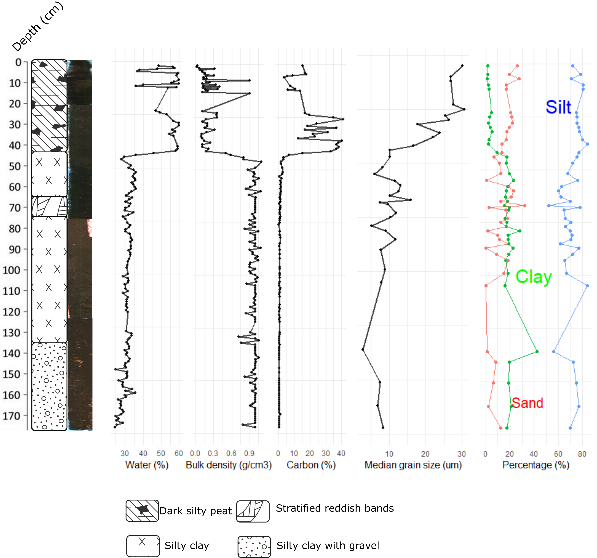
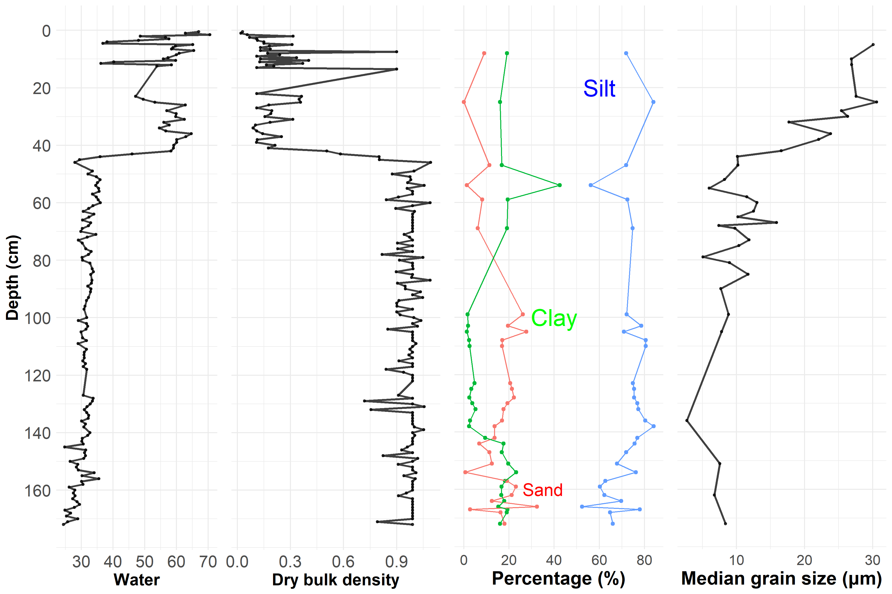
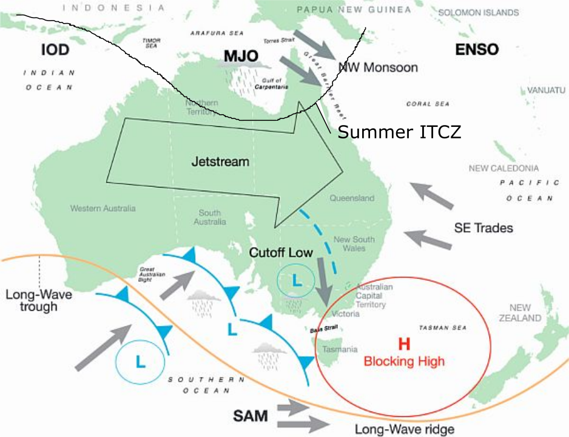
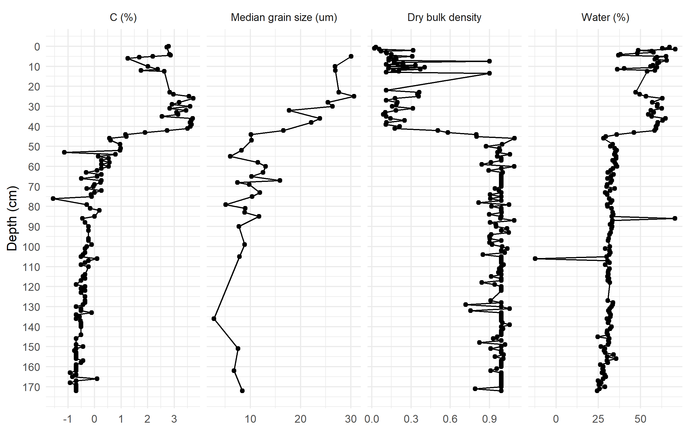

# Sedimentology and stratigraphy 
```{r str, echo = FALSE, cache = FALSE, include = FALSE}
library(knitr)
library(here)
library(bookdown)
library(tidyverse)


read_chunk('C:/Users/Maria Jose Rivera/OneDrive - James Cook University/Australia renamed/Sanamere/Thesis sections/PhD/analysis/Radiocarbon/an_radiocarbon-LAPTOP-3NCFQGAR.R')


#read_chunk('C:/Users/Maria Jose Rivera/OneDrive - James Cook University/Australia #renamed/Sanamere/Thesis sections/PhD/analysis/Radiocarbon/an_radiocarbon-LAPTOP-3NCFQGAR.R')

read_chunk('C:/Users/Maria Jose Rivera/OneDrive - James Cook University/Australia renamed/Sanamere/Thesis sections/PhD/preprocessing/pre_age_model.R')

```
This chapter describes the coring techniques used during fieldwork, along with the sedimentology and stratigraphy of the sediment core collected, and constitutes the basis for the interpretation of the following three chapters.  

## Fieldwork and coring techniques

Sanamere Lagoon was cored using a floating platform with hydraulic coring-rig, positioned at the approximate centre of the water body (11.123°S, 142.359°E) during fieldwork undertaken in July 2017. The coring location was chosen based on previous reconnaissance work carried out in May and April 2016. Although the coring technique allowed the preservation of the sediment-water interface, visual inspection of the core suggested the disturbance of this section. At the time of sampling, water depth was 1.2 m. A stainless steel tube of 100 mm diameter and 1.6 mm wall thickness was used when coring to provide a large volume of sample material. A single sediment core of 1.72 m was collected (to the point of bedrock), cut in four portions and frozen onsite immediately so it maintained stratigraphic integrity. This column represents the entire sediment sequence in the lagoon, as the corer bottomed on laterite bedrock. The four portions were stored frozen at James Cook University, Cairns until further analysis. A series of water depth measurements were taken across a transect to build a cross section of depths (Figure \@ref(fig:depth)).

```{r depth,out.width = '80%', fig.align = "center", fig.cap = "(ref:depth)",echo=FALSE}

#include_graphics("Figs/SAN copy.png")

include_graphics(here("Figs","depth_transect_2.png"))
```
(ref:depth) A) Satellite image of Sanamere showing the transect of surface sampling, B) Cross section of depths across Sanamere Lagoon

```{r depth2, echo = FALSE, cache = FALSE, include = FALSE, warning=FALSE}

depth<-read.csv(here("data","depth_pr.csv"))

depth_pr<-depth

       
TI<-ggplot(depth, aes(x=`Distance.from.shore`,y=`Depth..cm.`/100))+ xlab("Distance from the shore (m)")+ ylab("Depth (m)")+geom_point()+ geom_line()+theme_bw()  +scale_x_reverse(breaks=c(0, 100, 200, 300, 400, 500), limits=c(550,0))+theme_bw(base_size=35)+scale_y_reverse()


```
## Methods

### Core processing

We returned the core sections to the cold room (4–5 °C) in the Advanced Analytical Centre at James Cook University, Cairns. We opened the core tubes longitudinally, photographed the core sections, and described sediment colors (Munsell) and textures using standard methods [@schnurrenbergerClassificationLacustrineSediments2003]. Subsequently, each core section was divided into three slices and each one was sub-sampled at 1 cm intervals. Two slices were stored frozen and intact for ITRAX analyses and archive purposes. The wet weight was recorded, samples were freeze-dried, and the ‘dry’ weight was also recorded for use in calculation of bulk density. One section of each core was scanned using the ITRAX micro X-ray Fluorescence (𝜇XRF) core scanner at the Australian Nuclear Science and Technology Organisation (ANSTO). The scans included optical and X-ray photographs of all sections.

### Basic physical parameters

The physical parameters were calculated following standard guidelines according to @hakansonPrinciplesLakeSedimentology1983.

#### Water content

The water content was calculated as the ratio of the weight of water (W), Ww in g, to the dry weight of solids, Ws in g:

$W = \frac{Ww}{Ws} = \frac{Wt-Ws}{Ws}*100$

where Wt = the total wet weight (in g)

#### Dry bulk density

Bulk density was determined by weighing the wet samples secured from known volumes, oven-drying the material, and re-weighing the sample, according to the following formulas [@taylorProceedingsOceanDrilling1992]:

$p = \frac{Ms}{V}$

$p = \frac{M-Mw}{V}$

where M= total mass of soil, Ms = the mass of the dry sample (weight of the solid portion of the sample), Mw = mass of water and V = the total volume 

#### Grain size {#grains}

Forty-two sediment samples, with a sample interval of 4 cm were dispersed with sodium hexametaphosphate and sieved at < 1000 $\mu$m. The < 1000 $\mu$m fraction was subsequently pretreated with 30 % hydrogen peroxide to remove organics and finally with 1 M NaOH to dissolve biogenic silica, leaving a clastic particulate residue for particle size determination. All pretreated samples were analysed using a Malvern Mastersizer 2000 laser diffraction spectrophotometer. The median grain size and the percentages of clay (< 2 $\mu$m), silt (> 2 $\mu$m and < 63 $\mu$m) and sand (> 63 $\mu$m) were obtained for each sample [@geeParticlesizeAnalysis1986]. Additionally, the percentage of coarse sand (> 275 $\mu$m, < 1000 $\mu$m) was also calculated. A correlation matrix between grain size and elemental concentrations was calculated to explore the relationships between these variables. Variability in grain size can indicate changing transport energy, lake levels, and/or the amount and energy of runoff into a sedimentary basin. The presence of larger grains in the sediment record indicates either increased precipitation (especially in closed-basin lake catchments) [@chenEnvironmentalRecordsLacustrine2004; @conroyHoloceneChangesEastern2008] or lower lake levels resulting from higher accumulation of the nearshore components and/or weaker monsoon circulation in tropical settings [@xiaoHoloceneWeakMonsoon2009]. 

### Basic chemical parameters

#### Carbon {#carbon1}

A representative aliquot of each freeze-dried sample was homogenized using a mortar and pestle. An aliquot of each sample (1–10 mg) was weighed into a tin capsule and crimped. The presence of carbonates was checked by comparing the measurements of a batch of 30 samples where carbonates were removed by acid with the results from the untreated batch. No differences were found between the two batches. Total organic carbon and nitrogen abundance and isotope composition of an aliquot of each (1–10 mg) were determined using a Costech elemental analyser fitted with a zero-blank auto-sampler coupled via a ConFloIV to a ThermoFinnigan DeltaV PLUS using continuous-flow isotope ratio mass spectrometry (EA-CF-IRMS) at James Cook University's Cairns Analytical Unit. Stable isotope results are reported as per mil (‰) deviations from the VPDB and AIR reference standard scale for $\delta$^13^C and $\delta$^15^N values respectively. Uncertainty on internal standards (‘Low Organic Carbon’ $\delta$^13^C −26.54 ‰, $\delta$^15^N 7.46 ‰; ‘Taipan’ $\delta$^13^C -11.65 ‰, $\delta$^15^N 11.64 ‰; and ‘Chitin’ $\delta$^13^C −19.16 ‰, $\delta$^15^N 2.20 ‰) was better than ± 0.1 ‰. Repeated measurements on samples showed that C and N concentrations were generally reproducible to ± 1 % (1$\sigma$).

#### Silicon, Titanium, Iron

XRF elemental profiles were completed for the four sections of the divided core (0-50, 50-100, 100-150, 150-172 cm), for a total of 172 cm, using the second-generation ITRAX core scanner located at the Australian Nuclear Science and Engineering Organisation. Operating conditions for XRF were 40 kV and 30 mA, step size 1000 μm and 10 seconds count time. The XRF scans produced data for a total of 25 elements and were performed using a chromium (to scan Al, Si, P, S, Cl, K, Ca, Sc, Ti, V, Cr) and molybdenum tube set (to scan Mn, Fe, Ni, Cu, Zn, Br, Rb, Sr, Y, Zr, Pd, Ba, La, Ce, Pb). Further information and statistical analyses are included in chapter 5. Optical and radiographic images were also taken of each core using the ITRAX scanner, during XRF scanning. Processing of ITRAX data was completed by ANSTO Facility Officer Dr. Patricia Gadd. ITRAX elemental counts were normalized using the procedure outlined by @rothwellNewTechniquesSediment2006 and @weltjePredictionGeochemicalComposition2015. In brief, elements of interest were selected their counts were divided by the total number of counts for that depth. More details about the methodology are available in chapter 5.

In this chapter the results of only three elements (Ti, Fe, Si) are shown, for the purposes of introducing the core stratigraphy.

## Results

### Core description {#core}

The sedimentary sequence for the Sanamere Lagoon is shown in Figure \@ref(fig:fig1) and Table \@ref(tab:tb-sed). Four initial stratigraphic zones were identified based on variations in the basic physical and chemical parameters along the core. The core description will follow a sequence starting at the bottom of the core, with the last section referring to the top of the core. The first layer (172 cm - 140 cm) consists of a dark brown colour (5 YR 5/8), with carbon content below 0.5 %. Over the interval from 140 to 65 cm mineral content gradually decreases and the colour is light brown (7.5 YR 4/3). A series of three orange (7.5 YR 6/8) 1-cm thick bands are evident over 71 cm - 65 cm (Figure \@ref(fig:bands)). Beginning at 65 cm, there is a marked decrease in organic content to values of 0.5 and 1 % over 43 cm and the sediment colour changes to reddish brown (5 YR 4/4). The upper 43 cm of the core consists of black (10YR 2/1), organic (5 % - 40 % carbon) sediments, including the presence of decomposed organic debris.

```{r fig1,out.width = '100%', fig.align = "center", fig.cap = "(ref:fig1)",echo=FALSE}
#
#include_graphics(here("other","Depth_str_chap_2.png")) #svg with the same name
#  #from pre_grain chunk str-sed include stratigraphy
include_graphics(here("other","Depth_str_chap_5.png")) #same name in svg CHANGE!
```
(ref:fig1) Stratigraphy of the Sanamere sediment core

```{r bands,out.width = '80%', fig.align = "center", fig.cap = "(ref:bands)",echo=FALSE}

include_graphics(here("Figs","Background","orange_bands_4.png"))

#
```
(ref:bands) Orange bands in the Sanamere core

### Physical parameters 

#### Water content

The water content in the sediment column varies between 70.5 % and 24.4 %. For the first three stratigraphic units (172 - 43 cm) the percentage stays between 24.4 % and 36 %. Starting at 43 cm (46 %) and until 26 cm, (63 %) there is a steep increase in water content, from which point it starts to drop to reach 36 % at 11.5 cm (Figure \@ref(fig:fig1)).

#### Dry bulk density

Dry bulk density varies between 0.02 and 1.1 g cm^-3^. Between 172 cm and 43 cm values remained between 1.1 and 0.71 g cm^-3^, starting to drop abruptly at 43 cm decreasing to the surface (Figure \@ref(fig:fig1)).

#### Grain size

Clastic material of less than 35 $\mu$m dominates most of the Sanamere sequence. Between 172 cm and 140 cm, very fine silt (6 - 10 $\mu$m) dominates the sequence. An abrupt increment in clay occurs at 136 cm, where clay (< 2 $\mu$m) increases to 45 %, while silt drops to 55 %. Between 140 cm and 43 cm, the sand percentage fluctuates between 2 % and 18 %, with the only exception at 65 cm, where it increases to 32 %. At 43 cm, the median grain size, sand and silt percentages increase and the clay percentage decreases. Sand surpasses clay at 38 cm and keeps increasing to the top of the core (Figure \@ref(fig:fig1)).

### Chemical parameters

#### Carbon and Nitrogen

The abundance of carbon percentage varies between 0.3 % and 41 % along the entire core. Values fluctuate between 0.32 % and 1.10 % between 172 cm and 43 cm, from where they start to increase until they reach 41 % at 26 cm. From 26 cm, they decrease gradually until the top of the core. The nitrogen percentage values range between 0.03 % and 1.5 %. Between 172 cm and 44 cm, they fluctuate between 0.03 % and 0.2 %, to then increase gradually to 1.1 % at 37 cm, where they gradually decrease to 0.3 % at 5.5 cm, with the exceptions of two high values (1.5 %) at 4 cm and 4.5 cm (Figure \@ref(fig:fig1)). Nitrogen and isotope (carbon and nitrogen) abundances will be discussed in chapters 5 and 6. 

#### Silicon, Titanium, Iron

Complete analysis and interpretation of the ITRAX record is performed in Chapter 5. High water content and low elemental counts prevented the use of the XRF scanning results from 7 cm to the top of the core. The description of Si, Ti and Fe is included in this section to support interpretation in chapter 4. Between 172 cm - 71 cm, the Ti counts stayed relatively constant with minor fluctuations (0.68 - 0.80). After 65 cm, the Ti counts fluctuate and decrease abruptly to 0.01 at 31 cm. From 31 cm, counts increase steadily again to the top of core (Figure \@ref(fig:fig-ele)). 

Between 172 cm and 140 cm there is minor fluctuations in the Si counts, with low values (0 - 0.07) dominating until 43 cm. Si values start to fluctuate between 0 and 0.32 until the end of the core. They increase rapidly to reach 0.32 at 26 cm (the highest value), to then decrease gradually to reach 0 counts at 18 cm. Finally, counts increase to 0.1 at 8 cm.

The Fe counts are highly consistent (0.95) until 43 cm from where they drop abruptly. Between 43 cm and 22 cm, they fluctuate (0.76 - 0.95). After this period, they increase and keep fluctuating between 0.41 and 1 between 18 cm and 9 cm. 

## Chapter 3 summary

The Sanamere core consists of a 1.72 m continuous sediment sequence with no evidence that the sedimentary sequence has dried out. The first layer (172 cm - 140 cm), is organic poor and very fined grained with moderate bulk density transitioning to an interval from 140 cm to 65 cm that is similar to the previous one unit, with lighter-coloured sediment and slightly coarser grains. This layer contains three orange bands between 71 and 65 cm. The unit between 65 - 43 cm changes to a reddish-brown color, with increased organic content. The unit between 43 - 0 cm is organic rich, with low bulk density as well as increased grain size and higher water content. High counts of Ti and Fe and low counts of Si dominated the core between 172 - 43 cm and a reverse trend is apparent for the top 43 cm. The following chapter deals with the dating of the sediment core.

```{r ages,echo = FALSE, cache = FALSE, include = FALSE}
```

```{r tb-one-pre,echo = FALSE, cache = FALSE, include = FALSE}
```

```{r tb-sed,echo = FALSE, eval=TRUE, include = TRUE,warning=FALSE}
```
(ref:tb-sed) Layers and units for the Sanamere core

```{r fig-ele,out.width = '80%', fig.align = "center", fig.cap = "(ref:fig-ele)",echo=FALSE}
include_graphics(here("Figs","ele_fig.png"))
#  #from pre_grain chunk str-sed include stratigraphy
```
(ref:fig-ele) Elemental counts in the Sanamere sequence

```{r fig2,echo = FALSE, eval=TRUE, include = FALSE,warning=FALSE}
  #from pre_grain chunk str-sed
# x_depth from pre_ITRAX 
```

```{r fig-strat,echo = FALSE, eval=FALSE, include = FALSE,warning=FALSE}

```
